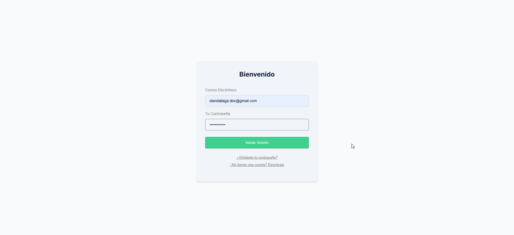

# Clone de Trello Full-Stack 🚀



> Clon funcional de Trello desarrollado con Next.js, Tailwind CSS y Supabase. Este proyecto permite a los usuarios registrarse, iniciar sesión y gestionar sus propias listas de tareas en tableros privados, con una interfaz interactiva que incluye funcionalidad de 'arrastrar y soltar' (drag and drop).

**Ver el proyecto en vivo:** [**https://trello-clone-livid-eta.vercel.app/**](https://trello-clone-livid-eta.vercel.app/)

---

## ✨ Características Principales

* **🔐 Autenticación de Usuarios:** Sistema completo de registro e inicio de sesión con Supabase Auth.
* **🔒 Sesiones y Rutas Protegidas:** Los usuarios solo pueden acceder a los tableros si han iniciado sesión.
* **📓 Datos privados:** Cada usuario tiene sus propios tableros y tareas, invisibles para otros usuarios, gracias a la Seguridad a Nivel de Fila (RLS) de Supabase.
* **↔️ Funcionalidad Drag and Drop:** Reordena tareas y muévelas entre columnas de forma fluida con `react-beautiful-dnd`.
* **💾 Persistencia de Datos:** Todos los cambios se guardan en tiempo real en la base de datos PostgreSQL de Supabase.
* **📱 Diseño Responsivo:** Interfaz adaptable a dispositivos móviles y de escritorio.

---

## 🛠️ Stack Tecnológico


---

## 🚀 Instalación y Uso Local

Para clonar y correr este proyecto en tu máquina local, sigue estos pasos:

1.  **Clona el repositorio:**
    ```bash
    git clone [https://github.com/TechDaveDev/trello-clone.git](https://github.com/TechDaveDev/trello-clone.git)
    cd trello-clone
    ```

2.  **Instala las dependencias:**
    ```bash
    npm install
    ```

3.  **Configura las variables de entorno:**
    * Crea un archivo `.env.local` en la raíz del proyecto.
    * Añade tus claves de Supabase (puedes encontrarlas en el panel de tu proyecto en Supabase > Project Settings > API):
    ```
    NEXT_PUBLIC_SUPABASE_URL=TU_URL_DE_SUPABASE
    NEXT_PUBLIC_SUPABASE_ANON_KEY=TU_ANON_KEY_DE_SUPABASE
    ```

4.  **Inicia el servidor de desarrollo:**
    ```bash
    npm run dev
    ```

Abre [http://localhost:3000](http://localhost:3000) en tu navegador para ver la aplicación.